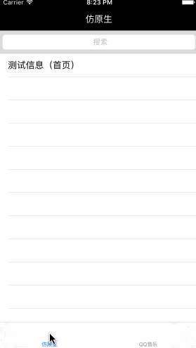

###前言
原生的UISearchBar虽然集成容易，但面对多变的需求越来越显得力不从心。于是自己写了一个可以较高程度自定义的SearchBar和相关的一些拓展控件。
###实现
由于我之前一般是使用UISearchBar+UISearchDisplayController的组合，还没有使用过UISearchController，所以我自定义的风格还是按照UISearchBar+UISearchDisplayController的组合来设计，对应的是RLCustomSearchBar+RLCustomSearchViewController.RLSearchButton其实是为了模拟原生效果而存在的。具体看Demo。
